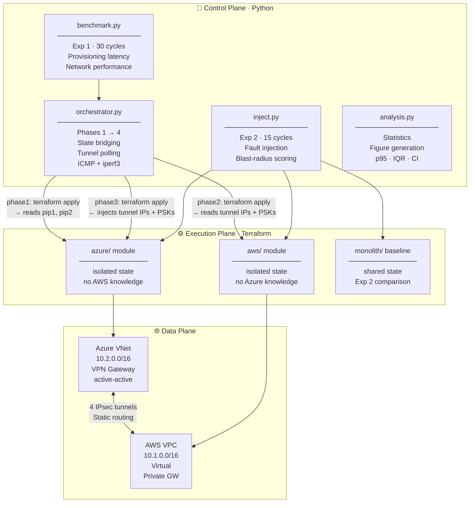
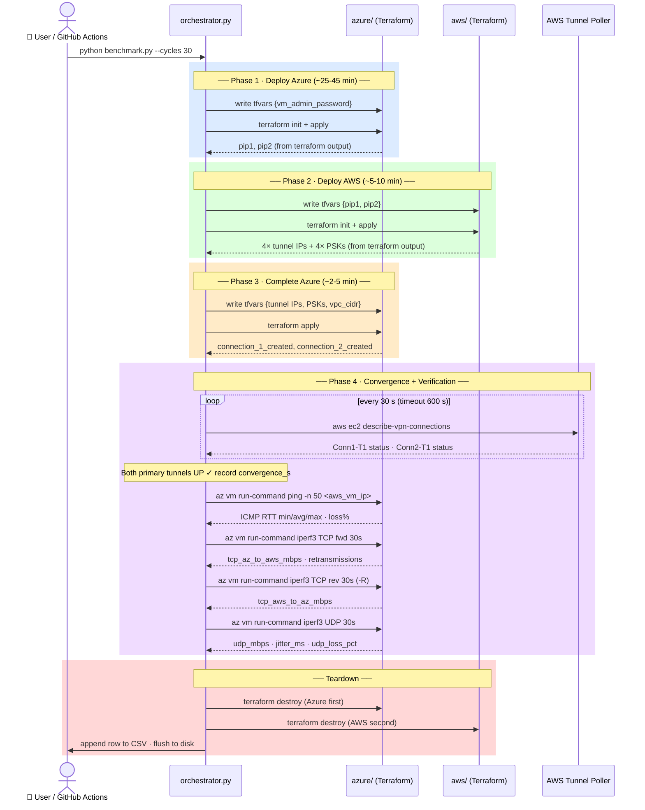
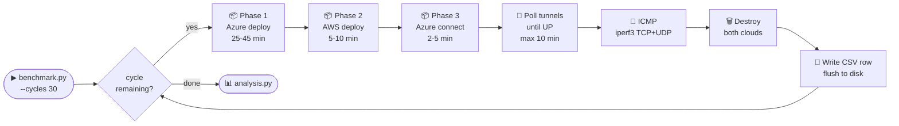
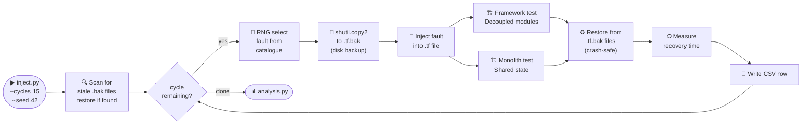
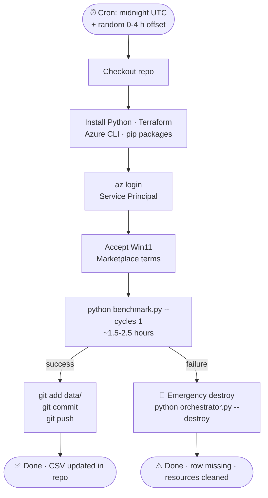

# Hybrid PL-IaC Multi-Cloud Network Orchestrator

> **Master's Research Artefact** — *"Hybrid PL-IaC Approach for Automated Modular Orchestration of Decoupled Multi-Cloud Networks"*

A lightweight Python control plane that automatically orchestrates two isolated Terraform modules to establish **dual active-active IPsec VPN tunnels** between AWS (ap-southeast-2) and Azure (australiaeast) — with zero hardcoded cross-cloud secrets and zero manual steps.

---

## Architecture



> The two Terraform modules share **no state** and have **no direct knowledge of each other**. Python bridges them by reading outputs from one module's state file and writing them into the other's `terraform.tfvars` at runtime. Pre-shared keys travel only through Python memory — never through any file committed to source control.

---

## Network Topology

```
  ╔══════════════════════════════════════════════════════════════════════╗
  ║   AZURE   ·   australiaeast   ·   VNet 10.2.0.0/16                  ║
  ║                                                                      ║
  ║   ┌─────────────────────────────────────────────────────┐            ║
  ║   │            VPN Gateway  (active-active)              │            ║
  ║   │                                                     │            ║
  ║   │  pip1 ●══════ Conn1-T1 (PRIMARY ACTIVE)  ═══════════╪═══╗        ║
  ║   │  pip1 ○┄┄┄┄┄┄ Conn1-T2 (AWS HA standby) ┄┄┄┄┄┄┄┄┄┄╪┄┄┄╢        ║
  ║   │  pip2 ●══════ Conn2-T1 (BACKUP ACTIVE)   ═══════════╪═╗ ║        ║
  ║   │  pip2 ○┄┄┄┄┄┄ Conn2-T2 (AWS HA standby) ┄┄┄┄┄┄┄┄┄┄╪┄╢ ║        ║
  ║   └─────────────────────────────────────────────────────┘ ║ ║        ║
  ║                                                            ║ ║        ║
  ║   ┌──────────────────────┐    ● = active tunnel           ║ ║        ║
  ║   │  Windows 11 Pro VM   │    ○ = AWS-managed HA standby  ║ ║        ║
  ║   │  Spot · D2als_v7     │                                ║ ║        ║
  ║   │  iperf3 CLIENT       │                                ║ ║        ║
  ║   │  (az run-command)    │                                ║ ║        ║
  ║   └──────────────────────┘                                ║ ║        ║
  ╚═══════════════════════════════════════════════════════════╪═╪════════╝
                              IPsec / IKEv1  │ │
                              Static Routing │ │
  ╔═════════════════════════════════════════╪═╪════════════════════════╗
  ║   AWS   ·   ap-southeast-2   ·   VPC 10.1.0.0/16                   ║
  ║                                        ║ ║                          ║
  ║         ┌──────────────────────────────╜ ║                          ║
  ║         │                               ╙──────────────────────┐   ║
  ║         ▼                                                       ▼   ║
  ║  ┌─────────────────┐                           ┌─────────────────┐  ║
  ║  │  VPN Connection │                           │  VPN Connection │  ║
  ║  │       1         │                           │       2         │  ║
  ║  │  CGW-1 = pip1   │                           │  CGW-2 = pip2   │  ║
  ║  │  T1 ● active    │                           │  T1 ● active    │  ║
  ║  │  T2 ○ standby   │                           │  T2 ○ standby   │  ║
  ║  └────────┬────────┘                           └────────┬────────┘  ║
  ║           └──────────────────┬─────────────────────────┘            ║
  ║                              ▼                                       ║
  ║              ┌───────────────────────────────┐                       ║
  ║              │   Virtual Private Gateway     │                       ║
  ║              └───────────────────────────────┘                       ║
  ║                                                                      ║
  ║   ┌──────────────────────┐                                           ║
  ║   │  Windows Server EC2  │                                           ║
  ║   │  Spot · t3.micro     │                                           ║
  ║   │  iperf3 SERVER       │                                           ║
  ║   │  (NSSM service)      │                                           ║
  ║   └──────────────────────┘                                           ║
  ╚══════════════════════════════════════════════════════════════════════╝
```

### Tunnel Reference

| Tunnel | Azure endpoint | AWS endpoint | State | Purpose |
|:---:|---|---|:---:|---|
| **Conn1-T1** | pip1 | VPN Connection 1 · Tunnel 1 | 🟢 Active | Primary data path |
| **Conn1-T2** | pip1 | VPN Connection 1 · Tunnel 2 | 🟡 Standby | AWS-managed HA backup |
| **Conn2-T1** | pip2 | VPN Connection 2 · Tunnel 1 | 🟢 Active | Backup data path |
| **Conn2-T2** | pip2 | VPN Connection 2 · Tunnel 2 | 🟡 Standby | AWS-managed HA backup |

---

## Three-Phase Orchestration



---

## Experiments

### Experiment 1 — Steady-State Performance



**CSV columns recorded per cycle** (35 total):

| Category | Columns |
|---|---|
| ⏱ Phase timing | `t_phase1/2/3_s` · `t_phase1/2/3_prov_s` · `t_phase1/2/3_proc_s` · `t_total_*` |
| 🔄 Convergence | `tunnel_convergence_s` |
| 🔒 Tunnel status | `tunnel1/2/3/4_up` · `active_tunnel_count` |
| 📡 ICMP | `icmp_rtt_min/avg/max_ms` · `icmp_packet_loss_pct` · `icmp_success` |
| 🚀 iperf3 | `tcp_az_to_aws_mbps` · `tcp_aws_to_az_mbps` · `udp_mbps` · `jitter_ms` · `udp_loss_pct` |
| 🗂 State isolation | `aws_state_resource_count` · `azure_state_resource_count` |
| ❌ Failure | `failure_phase` · `failure_type` · `failure_reason` |
| 🏷 Metadata | `cycle` · `timestamp_utc` · `run_source` · `github_run_id` |

### Experiment 2 — Fault Injection



**Fault catalogue** (9 faults · 4 categories · seeded for reproducibility):

| ID | Category | What breaks | Framework blast radius | Monolith blast radius |
|:---:|:---:|---|:---:|:---:|
| SYN-01 | 🔴 Syntax | AWS VPC CIDR `/99` (invalid prefix) | AWS only fails | Both fail |
| SYN-02 | 🔴 Syntax | Azure VNet CIDR `10.2.0.0/999` | Azure only fails | Both fail |
| SYN-03 | 🔴 Syntax | EC2 instance type `t99.invalid` | AWS only fails | Both fail |
| SEM-01 | 🟠 Semantic | AWS subnet outside VPC range | AWS only fails | Both fail |
| SEM-02 | 🟠 Semantic | GatewaySubnet `/32` (below `/27` min) | Azure only fails | Both fail |
| RUN-01 | 🟡 Runtime | Non-existent AMI ID | AWS only fails | Both fail |
| RUN-02 | 🟡 Runtime | Spot price below floor | AWS only fails | Both fail |
| CC-01 | 🔵 Cross-cloud | VPN static route CIDR mismatch | Tunnels silently broken | Both fail |
| CC-02 | 🔵 Cross-cloud | Azure VNet CIDR mismatch | Tunnels silently broken | Both fail |

**Blast radius scoring**: `0` = neither cloud provisioned · `1` = one cloud provisioned · `2` = both clouds provisioned despite the fault.

### Figures produced by analysis.py

| Figure file | What it shows |
|---|---|
| `exp1_phase_breakdown.png` | Per-phase mean duration ± 95% CI bar chart |
| `exp1_total_distribution.png` | Total provisioning time histogram with mean, median, p95 |
| `exp1_prov_vs_proc.png` | Stacked bar: Terraform apply vs Python overhead per phase |
| `exp1_convergence.png` | Tunnel convergence scatter over cycles + box plot |
| `exp1_rtt_vs_threshold.png` | ICMP RTT per cycle vs ITU-T G.114 150 ms threshold |
| `exp1_throughput.png` | iperf3 TCP bidirectional throughput per cycle |
| `exp2_blast_radius.png` | Blast radius grouped bar: framework vs monolith |
| `exp2_recovery_time.png` | Recovery time box plot: framework vs monolith |

---

## Project Structure

```
automated multi-cloud orchestrator/
│
├── 🔧  orchestrator.py          Control plane — all 4 phases, tunnel polling,
│                                ICMP + iperf3 tests, destroy
│
├── 📊  benchmark.py             Experiment 1 — 30-cycle steady-state benchmark
├── 💉  inject.py                Experiment 2 — fault injection with seeded RNG
├── 📈  analysis.py              Statistical analysis + 8 figures
├── ✅  validate.py              Pre-flight checks (syntax, terraform, CLI, env)
│
├── ☁️  azure/
│   ├── main.tf                  VNet, active-active VPN GW (pip1+pip2),
│   │                            2×LNG + 2×IPsec Connection (conditional, Phase 3)
│   │                            Windows 11 VM + CustomScriptExtension (iperf3)
│   ├── variables.tf             aws_tunnel_ip/2, aws_preshared_key/2,
│   │                            vm_admin_password (sensitive, no default)
│   └── outputs.tf               vpn_gateway_public_ip_1/2,
│                                connection_1/2_created, VM IPs
│
├── ☁️  aws/
│   ├── main.tf                  VPC, IGW, route table,
│   │                            2×Customer GW, 2×VPN Connection,
│   │                            Windows EC2 Spot (NSSM iperf3 server)
│   ├── variables.tf             azure_gateway_ip, azure_gateway_ip_2, CIDRs
│   └── outputs.tf               4× tunnel IPs, 4× PSKs,
│                                2× VPN connection IDs, vpc_cidr
│
├── 🏗  monolith/
│   └── main.tf                  Both clouds in one file — Experiment 2 baseline.
│                                Cross-cloud refs via Terraform dependency graph.
│                                No Python orchestration. No state isolation.
│
├── 🤖  .github/workflows/
│   └── daily_benchmark.yml      Runs 1 cycle/day at randomised time,
│                                commits results back to repo
│
├── 📁  data/                    CSV output — committed to git
│   ├── exp1_steady_state_YYYY-MM-DD.csv
│   └── exp2_fault_injection_YYYY-MM-DD.csv
│
├── 📁  results/figures/         PNG plots from analysis.py
│
└── 📄  requirements.txt         pip packages + system tool prerequisites
```

---

## Prerequisites

### System tools

| Tool | Min version | Install | Used by |
|---|---|---|---|
| 🐍 Python | 3.9+ | [python.org](https://www.python.org/downloads/) | All scripts |
| 🏗 Terraform CLI | 1.5+ | [hashicorp.com](https://developer.hashicorp.com/terraform/install) | All scripts |
| ☁️ Azure CLI (`az`) | Latest | [microsoft.com](https://learn.microsoft.com/en-us/cli/azure/install-azure-cli) | Phase 4 run-command · service principal auth |
| 🔶 AWS CLI v2 | Latest | [aws.amazon.com](https://docs.aws.amazon.com/cli/latest/userguide/install-cliv2.html) | Phase 4 tunnel status polling |

### Python packages (analysis.py only)

```bash
pip install -r requirements.txt
```

`orchestrator.py`, `benchmark.py`, `inject.py`, and `validate.py` use the Python standard library only.

---

## Setup

```
Step 1 ──── AWS credentials
Step 2 ──── Azure credentials + subscription
Step 3 ──── VM admin password (env variable)
Step 4 ──── Accept Windows 11 marketplace terms
Step 5 ──── Initialise Terraform modules
Step 6 ──── Validate everything
```

### Step 1 — AWS credentials

```powershell
# PowerShell (Windows / GitHub Actions)
$env:AWS_ACCESS_KEY_ID     = "your-access-key"
$env:AWS_SECRET_ACCESS_KEY = "your-secret-key"
$env:AWS_DEFAULT_REGION    = "ap-southeast-2"
```

```bash
# Bash (Linux / macOS)
export AWS_ACCESS_KEY_ID="your-access-key"
export AWS_SECRET_ACCESS_KEY="your-secret-key"
export AWS_DEFAULT_REGION="ap-southeast-2"
```

### Step 2 — Azure credentials

**Interactive login** (local development):
```powershell
az login
$env:ARM_SUBSCRIPTION_ID = "your-subscription-id"
```

**Service principal** (CI/CD, GitHub Actions):
```powershell
# Create the service principal once
az ad sp create-for-rbac `
  --name "pliac-orchestrator" `
  --role Contributor `
  --scopes /subscriptions/<subscription-id>
# → outputs clientId, clientSecret, tenantId

$env:ARM_SUBSCRIPTION_ID = "your-subscription-id"
$env:ARM_TENANT_ID       = "your-tenant-id"
$env:ARM_CLIENT_ID       = "your-client-id"
$env:ARM_CLIENT_SECRET   = "your-client-secret"
```

### Step 3 — VM admin password

The Azure VM password is **never stored in any file**. Set it as an environment variable before every run:

```powershell
$env:AZURE_VM_PASSWORD = "YourPassword!2026"
```

> ⚠️ Azure complexity rules: minimum 12 characters, must include uppercase, lowercase, number, and symbol.

### Step 4 — Accept Windows 11 Marketplace terms (once per subscription)

```bash
az vm image terms accept \
  --publisher MicrosoftWindowsDesktop \
  --offer Windows-11 \
  --plan win11-24h2-pro
```

### Step 5 — Initialise Terraform modules

```bash
cd azure    && terraform init && cd ..
cd aws      && terraform init && cd ..
cd monolith && terraform init && cd ..
```

### Step 6 — Validate the full setup

```bash
python validate.py
```

Expected output:
```
══════════════════════════════════════════════════════════
  PL-IaC Orchestrator — Pre-flight Validation
══════════════════════════════════════════════════════════

── Python syntax ──────────────────────────────────────────
  [PASS]  orchestrator.py
  [PASS]  benchmark.py
  [PASS]  inject.py
  [PASS]  analysis.py
  [PASS]  validate.py

── Terraform formatting (terraform fmt -check) ────────────
  [PASS]  azure/
  [PASS]  aws/
  [PASS]  monolith/

── Terraform validate ─────────────────────────────────────
  [PASS]  azure/
  [PASS]  aws/
  [PASS]  monolith/

── CLI tools ──────────────────────────────────────────────
  [PASS]  terraform
  [PASS]  aws cli
  [PASS]  azure cli (az)

── Required environment variables ─────────────────────────
  [PASS]  AZURE_VM_PASSWORD
  [PASS]  ARM_SUBSCRIPTION_ID
  [PASS]  AWS_ACCESS_KEY_ID
  [PASS]  AWS_SECRET_ACCESS_KEY
  [PASS]  AWS_DEFAULT_REGION

══════════════════════════════════════════════════════════
  5/5 checks passed
══════════════════════════════════════════════════════════
All checks passed. Safe to run benchmark.py.
```

---

## Running

### Quick-reference command map

```
┌─────────────────────────────────────────────────────────────────────┐
│  python validate.py                  → pre-flight checks            │
│                                                                     │
│  python orchestrator.py              → single deploy + verify       │
│  python orchestrator.py --destroy    → tear down all infrastructure │
│                                                                     │
│  python benchmark.py --cycles 30     → Experiment 1 (30 cycles)    │
│  python benchmark.py --cycles 5      → smoke test (5 cycles)       │
│                                                                     │
│  python inject.py --cycles 15        → Experiment 2 (15 cycles)    │
│  python inject.py --cycles 15 --seed 42  → reproducible run        │
│                                                                     │
│  python analysis.py                  → auto-discover latest CSVs   │
│  python analysis.py --exp1 data/exp1_2026-06-14.csv                │
│  python analysis.py --exp2 data/exp2_2026-06-14.csv                │
└─────────────────────────────────────────────────────────────────────┘
```

### What each run produces

```
benchmark.py run                inject.py run               analysis.py run
──────────────────              ─────────────────           ───────────────
data/                           data/                       results/figures/
└── exp1_steady_state_          └── exp2_fault_             ├── exp1_phase_breakdown.png
    YYYY-MM-DD.csv                  injection_              ├── exp1_total_distribution.png
    (35 columns,                    YYYY-MM-DD.csv          ├── exp1_prov_vs_proc.png
     1 row per cycle,               (17 columns,            ├── exp1_convergence.png
     append-only)                    1 row per cycle)       ├── exp1_rtt_vs_threshold.png
                                                            ├── exp1_throughput.png
                                                            ├── exp2_blast_radius.png
                                                            └── exp2_recovery_time.png
```

---

## GitHub Actions — Automated Daily Collection



### Required GitHub Secrets

Navigate to: **Repository → Settings → Secrets and variables → Actions → New repository secret**

| Secret name | Value |
|---|---|
| `AWS_ACCESS_KEY_ID` | IAM user access key |
| `AWS_SECRET_ACCESS_KEY` | IAM user secret key |
| `ARM_SUBSCRIPTION_ID` | Azure subscription ID |
| `ARM_TENANT_ID` | Service principal tenant ID |
| `ARM_CLIENT_ID` | Service principal client ID |
| `ARM_CLIENT_SECRET` | Service principal client secret |
| `AZURE_VM_PASSWORD` | VM admin password (complexity rules apply) |

### Controlling the workflow

| Action | How |
|---|---|
| ▶️ Start automated collection | Push `daily_benchmark.yml` to main — schedule activates automatically |
| ⏸ Pause | GitHub → Actions → daily_benchmark → `···` → **Disable workflow** |
| ▶️ Resume | Same menu → **Enable workflow** |
| 🖐 Manual run now | GitHub → Actions → daily_benchmark → **Run workflow** |
| 🔍 View data | `data/exp1_steady_state_YYYY-MM-DD.csv` in the repository |

> Each run appends one row. After 30 days of automated runs you will have 30 independent data points ready for `analysis.py`.

---

## Network Configuration Reference

| Parameter | AWS | Azure |
|---|---|---|
| **Region** | ap-southeast-2 (Sydney) | australiaeast |
| **Network CIDR** | 10.1.0.0/16 | 10.2.0.0/16 |
| **Workload subnet** | 10.1.1.0/24 | 10.2.1.0/24 |
| **Gateway subnet** | — | 10.2.255.0/27 |
| **VPN Gateway SKU** | Standard (VGW) | VpnGw1AZ · zone-redundant |
| **Gateway mode** | — | Active-active (pip1 + pip2) |
| **Customer Gateways** | 2 (one per pip) | — |
| **VPN Connections** | 2 (primary + backup) | 2 (primary + backup) |
| **BGP ASN** | 65000 (both CGWs) | 65000 |
| **Routing** | Static | Route-based |
| **Test VM OS** | Windows Server · Spot · t3.micro | Windows 11 Pro · Spot · D2als_v7 |
| **iperf3 role** | Server — NSSM Windows service | Client — triggered via az run-command |
| **VM password source** | N/A (AWS key pair) | `AZURE_VM_PASSWORD` env var |

---

## ⚠️ Security Notes (Research Use Only)

> This is a proof-of-concept for academic research. **Do not deploy in production.**

| Warning | Detail |
|---|---|
| 🔓 **Open NSG / Security Group** | All inbound/outbound traffic allowed (`0.0.0.0/0`) so ICMP and iperf3 work without interference. Restrict to minimum CIDRs and ports in production. |
| 🔥 **Windows Firewall disabled** | Both VMs disable the Windows Firewall during provisioning so ICMP replies work immediately. In production, keep the firewall enabled and add specific ICMP inbound rules. |
| 🖼 **Hardcoded AMI ID** | `ami-094281959696a6b6c` is region-specific (ap-southeast-2) and will expire when AWS deprecates it. Replace with the latest Windows Server AMI for ap-southeast-2 from the AWS Console if apply fails. |
| 🔑 **Monolith baseline password** | `monolith/main.tf` has a hardcoded `admin_password` because the monolith is purely a comparison baseline used by `inject.py` — it is never deployed outside of Experiment 2. |

---

## Known Limitations

| Limitation | Impact | Notes |
|---|---|---|
| Azure VPN GW takes 25–45 min to provision | Phase 1 is the dominant cost in every cycle | Fixed Azure platform constraint; no workaround |
| Spot instance eviction | ICMP/iperf3 columns may be `null` for that cycle | Provisioning timing data is still recorded; cycle is not lost |
| `Standard_D2als_v7` availability | Azure apply fails on VM if size unavailable | Change to `Standard_D2s_v3` in `azure/main.tf` |
| Local Terraform state only | Manual cleanup needed if interrupted mid-cycle | Run `python orchestrator.py --destroy` to recover |
| AWS AMI may be deprecated | EC2 apply fails with "AMI not found" | Replace AMI ID with current Windows Server for ap-southeast-2 |

---

## Cost Estimate

One full deploy-test-destroy cycle takes approximately **1.5–2.5 hours**:

| Resource | Hourly rate | Notes |
|---|---|---|
| Azure VpnGw1AZ | ~$0.35 / hr | Provisioning dominates — 25–45 min |
| AWS VPN Connection × 2 | ~$0.10 / hr | Primary + backup connection |
| AWS t3.micro Spot | ~$0.005 / hr | iperf3 server |
| Azure D2als_v7 Spot | ~$0.04 / hr | iperf3 client |
| **Total** | **~$0.50 / hr** | |

| Experiment | Cycles | Est. duration | Est. cost |
|---|:---:|---|---|
| Experiment 1 (benchmark) | 30 | ~45–75 hours | ~$23–$38 |
| Experiment 2 (fault injection) | 15 | ~8–15 hours | ~$4–$8 |
| GitHub Actions (1 cycle/day) | 1/day | ~1.5–2.5 hr/day | ~$0.75–$1.25/day |

> Always run `python orchestrator.py --destroy` when finished. The GitHub Actions workflow includes an automatic emergency destroy step on failure.

---

## References

Key design decisions follow:
- **Hauser et al. (2020)** — SDN-inspired decoupled control/data plane separation
- **Rahman et al. (2019)** — avoiding hardcoded secrets ("security smells" in IaC)
- **Pahl et al. (2020)** — eliminating configuration drift via programmatic state injection
- **Sokolowski et al. (2023)** — decentralised IaC modularisation patterns
- **ITU-T G.114** — 150 ms RTT threshold for real-time communications compliance
